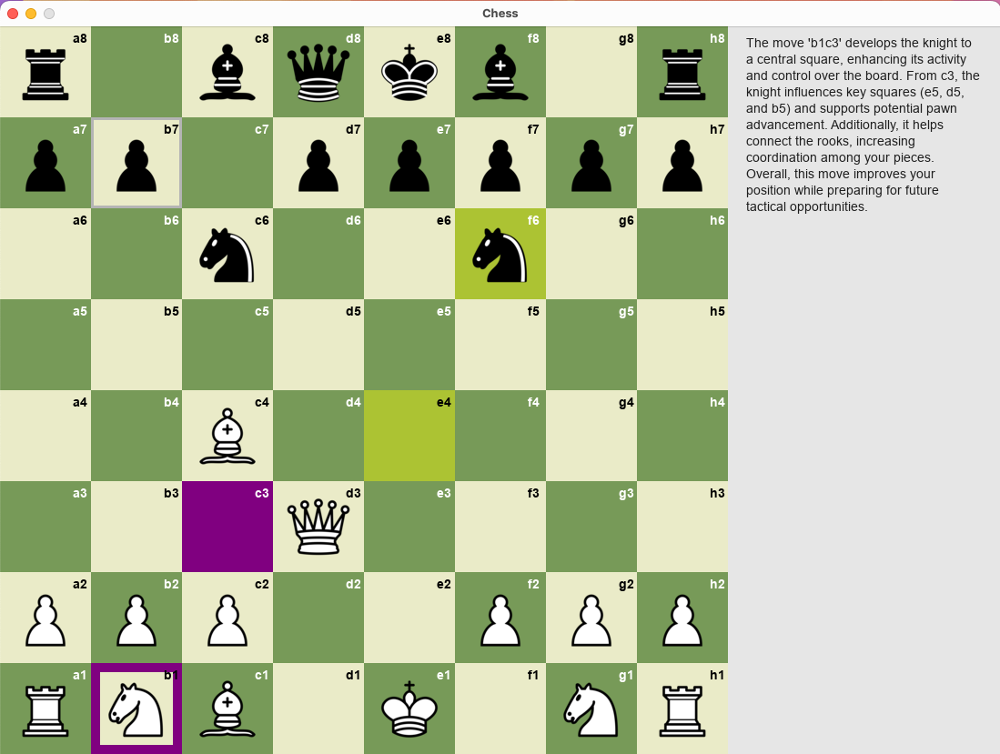

# Chess Personal Trainer

Welcome to **Chess Personal Trainer**, a chess game that helps you become a better player! Whether you're a beginner or an advanced player, this project combines the powerful Stockfish engine for move suggestions and ChatGPT for clear, informative explanations of the strategy behind those moves.



## Features

- **Play against Stockfish**: Challenge yourself by playing against Stockfish, one of the best chess engines out there. You can choose the depth of Stockfish for both the ally (your moves) and the enemy (Stockfish's moves).
  
- **Move Suggestions**: Want to improve your game? Stockfish suggests the best moves to make. You can even choose to get suggestions only after a specific round, helping you focus on learning at your own pace.

- **Learn from the Moves**: No more blindly following chess engine suggestions! After each suggestion, **ChatGPT** explains why the move is important and how it helps your position. It’s like having a chess coach right by your side.

- **Color Choice**: Choose your color and start training as either white or black, tailoring your experience.

- **Customizable Depth**: Adjust the depth of the Stockfish engine for both your side and the opponent's side. The greater the depth, the more strategic the engine becomes!

- **Engaging UI**: The game is built with **Pygame** for an intuitive, easy-to-use interface that makes playing and learning chess fun!

## Installation

To get started with **Chess Personal Trainer**, follow these simple steps.


### Install Dependencies

```bash
pip install -r requirements.txt
```

### Setup OpenAI
To enable the ChatGPT explanations, you need an OpenAI API key. You can get your API key from OpenAI. Once you have it, create a `.env` file in the root of the project and add your key:

```
OPENAI_API_KEY=your-api-key-here
```

### Run the Game
Once everything is set up, you can start the game by running:
```
python main.py
```